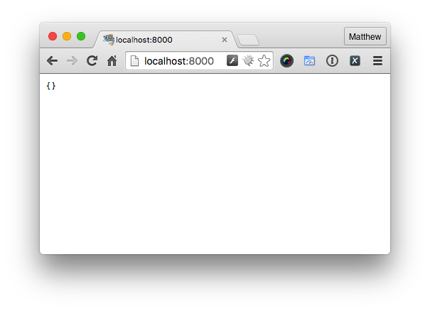

# Piston
Opinionated Micro Framework for APIs

[](https://travis-ci.org/refinery29/piston)
[](https://codeclimate.com/github/refinery29/piston)
[](https://codeclimate.com/github/refinery29/piston/coverage)
[](https://www.versioneye.com/user/projects/55c35f4d6537620020002d4c)

## Installation

Piston can be installed by using either git or [Composer](http://getcomposer.org).

### Git

Run `git clone https://github.com/refinery29/piston.git` to get the latest copy of the repository, which will clone the repository to a local directory called `piston`.

### Composer

If you have an existing project, or are starting a new project Composer is likely the simplest way to set it as a project dependency. You can either have composer do everything for you, by running `composer require refinery29/piston`.

Or you can manually add `"refinery29/piston": "^1-stable"` to your composer.json’s require section and run `composer update` or `composer install` afterwards.

## Basic Application

Here's the simplest Piston app you could write. First a new `Piston` object is instantiated and to that object a route is added using the `addRoute()` method. This method takes three parameters:

- **The Route Method:** Can be either a single method, or an array of supported methods
- **The Route:** A string containing either a static or parameterized route
- **A Handler:** This needs to accept both a Request and Response object

In the example below we’ve add a default route using an anonymous function as the handler.

```php
require_once('vendor/autoload.php');

use Refinery29\Piston\ApiResponse as Response;
use Refinery29\Piston\Piston;
use Refinery29\Piston\Request;

$application = new Piston();
$application->addRoute(
  'GET', '/',
  function(Request $request, Response $response) {
    return $response;
  }
);

$application->launch();
```

After the routes have been setup, the `launch()` method is called. This then attempts to render the process pipeline and dispatch the client request, resulting in emitting a response back to the client. It won’t do anything special, simply returning a JSON response which, if rendered in the browser, would look like the following:



## Routing

Piston supports class based routing. The class being routed to must return an instance of `Refinery29\Piston\Http\Request`. Routes are implemented as simple value objects that hold a url alias, http verb, and an action. Here’s a basic implementation of a class:

```php
<?php
namespace DummyPistonApp;

use Refinery29\Piston\Request;
use Refinery29\Piston\ApiResponse as Response;

class JediController
{
    public function __invoke(Request $request, Response $response)
    {
        return $response;
    }
}
```

And here's the previous example revised to use that controller class as the route's handler.

```php
require_once('vendor/autoload.php');

use DummyPistonApp\JediController;
use Refinery29\Piston\Piston;

$jediController = new JediController();
$application = new Piston();
$application->addRoute('GET', '/', $jediController);

$application->launch();
```

### Parameterized Routing

`league/route` allows for parameterized routes such as `/jedi/master/{name}`. You are able to enforce that the parameters be either a number of a word: `{id:number}/{name:word}`.

### Route Groups
There is also the ability to create Route groups that can bundle certain routes together. For instance, if you have a set of routes that are Admin accessible, you can create a group for those routes.

```php
$application = new Application();

$route1 = Route::get('jedi/{id}', 'JediController::useTheForce'));
$route2 = Route::get('sith/{id}', 'SithController::useTheForce'));

$group = new RouteGroup();
$group->addRoute($route1);
$group->addRoute($route2);

$application->addRouteGroup($group);
```

Route Groups also accept a url segment as a second parameter:

```php
$group = new RouteGroup([], 'admin');
```
All routes in this group will have urls that are prepended with this url segment, resulting in the URL `admin/route_url`.

### Pipelines
Piston provides a number of different points in the execution of the application that you can hook into to add functionality. This allows you to take action at different points, as you launch the app.

Pipelines exist at two levels:
- Application/Global level
- Route Group level

Hooks are applied in order from least specific to most specific. Application, then RouteGroup.

Hooks must implement `League\Pipeline\StageInterface` and define a `process()` method which must return an instance of `Refinery29\Piston\Http\Request`

```php
$hook = new UseTheForceHook();
$application->addPre($hook);
```

### Decorators
Piston allows itself to be decorated too add functionality.

Decorators must implement `Refinery29\Piston\Decorator` interface and define a `register()` function. The `register()` function must return an instance of 'Refinery29\Piston\Piston`.

### Service Providers
[Service providers](http://container.thephpleague.com/service-providers/) can be easily added to encapsulate any service necessary to the application. Any service provider class must implement `League\Container\ServiceProvider`

```php
$application = new Piston();
$application->register(new LightSaberProvider());
```

### Query Parameters
Piston is an api focused framework, and therefore encapsulates a number of different query parameter options.

**Fields**
Specific fields can be requested of the application, with the purpose of only returning those fields. Fields are specified as a comma separated list.

`url.com?fields=jedi,sith,yoda`

The above URL is automatically parsed, and you are able to retrieve that information as follows:

`$request->getRequestedFields();`

You can determine if the request has requested fields:
`$request->hasRequestedFields()`

**Pagination**
Piston currently supports only cursor based pagination.

`url.com?before=124ksl&after=0809asdj`
These parameters are available on the request as follows:

`$request->getPaginationCursor()`

This function returns an array with the keys `before` and `after`

You can determine if the request is paginated:
`$request->isPaginated()`

**Included Resources**
You may also request different relations be included in the response.

`url.com?include=master,padawan,planet`

These parameters will be available:
`$request->getIncludedResources()` which will return an array of requested relations.

*Nested Relations*
You are also able to request nested resources.

`url.com?include=jedi.master.padawan,planet`

These parameters are accessed in the same way as single level relations, however the result is different:

```
array
	[0] => array
   				[0] => jedi
   				[1] => master
   				[2] => padawan
   	[1] => planet
```


All of the above filters are only allowed on `GET` requests. Use of any of these parameters will result in an error if used with any other HTTP verb.
